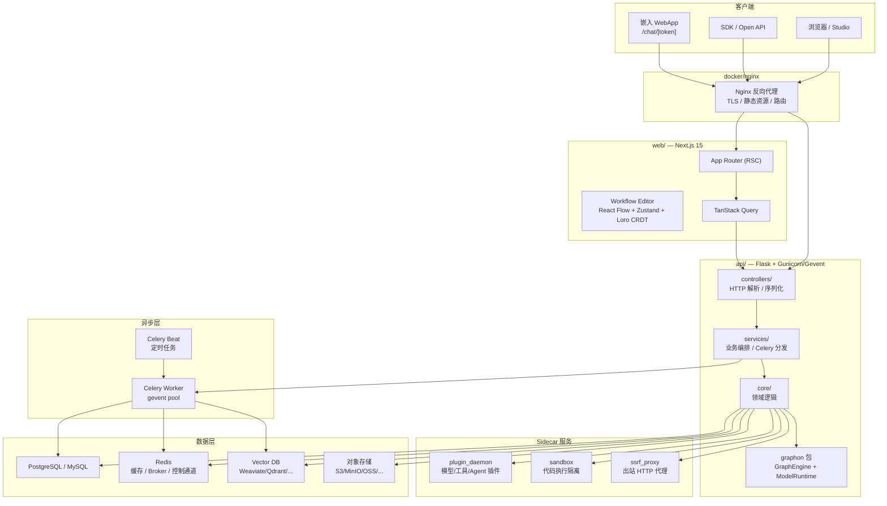
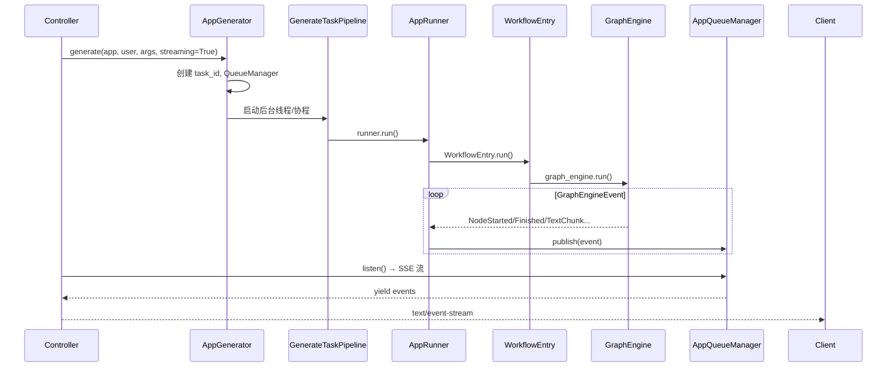
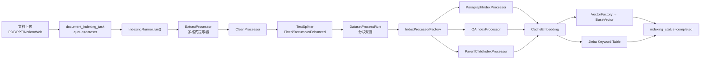

# Dify 1.14.2 架构深度分析

> 本文基于源码 walkthrough 整理，覆盖整体架构、核心工作流程、技术栈、设计亮点及底层实现细节。
> 分析版本：Dify 1.14.2（Monorepo）

---

## 目录

1. [项目概览](#1-项目概览)
2. [Monorepo 结构](#2-monorepo-结构)
3. [整体架构](#3-整体架构)
4. [后端分层架构](#4-后端分层架构)
5. [Flask 应用启动与 Extension 体系](#5-flask-应用启动与-extension-体系)
6. [HTTP 请求与认证](#6-http-请求与认证)
7. [应用模式与执行流水线](#7-应用模式与执行流水线)
8. [Workflow 图引擎（graphon）](#8-workflow-图引擎graphon)
9. [流式输出与事件队列](#9-流式输出与事件队列)
10. [RAG 知识库流水线](#10-rag-知识库流水线)
11. [Agent 执行架构](#11-agent-执行架构)
12. [模型 Provider 抽象](#12-模型-provider-抽象)
13. [Plugin 插件体系](#13-plugin-插件体系)
14. [Celery 异步任务体系](#14-celery-异步任务体系)
15. [多租户与配额隔离](#15-多租户与配额隔离)
16. [安全机制](#16-安全机制)
17. [存储与数据库](#17-存储与数据库)
18. [领域事件系统](#18-领域事件系统)
19. [可观测性](#19-可观测性)
20. [前端架构](#20-前端架构)
21. [Docker 部署拓扑](#21-docker-部署拓扑)
22. [Dify Agent 独立服务](#22-dify-agent-独立服务)
23. [技术栈总览](#23-技术栈总览)
24. [设计亮点总结](#24-设计亮点总结)
25. [源码阅读路径](#25-源码阅读路径)

---

## 1. 项目概览

Dify 是一个**开源 LLM 应用开发平台**，将以下能力整合在统一界面中：

| 能力 | 说明 |
|------|------|
| **Workflow** | 可视化 DAG 编排，支持并行、循环、条件分支、Human-in-the-loop |
| **RAG** | 文档摄取 → 分块 → 嵌入 → 向量/关键词索引 → 混合检索 → Rerank |
| **Agent** | Function Calling / ReAct / 插件化 Agent 策略 |
| **Prompt IDE** | 提示词编排、多模型对比、TTS 等 |
| **Model Management** | 50+ Provider，凭证管理、负载均衡 |
| **LLMOps** | 日志、标注、Opik / Langfuse / Phoenix 等追踪集成 |
| **BaaS** | 全能力 Open API 对外暴露 |

产品定位：**从原型到生产的 LLM 应用平台**，支持 Cloud SaaS 与 Self-hosted Docker/K8s 部署。

---

## 2. Monorepo 结构

```
dify-1.14.2/
├── api/                  # Python Flask 后端（核心业务）
├── web/                  # Next.js 15 前端
├── docker/               # Docker Compose 部署配置
├── dify-agent/           # 独立 Agent 运行时（Agenton）
├── packages/
│   ├── dify-ui/          # 共享 UI 组件库（Base UI + Tailwind v4）
│   ├── contracts/        # 前后端 API 契约（oRPC）
│   ├── dev-proxy/        # 本地开发代理
│   └── tsconfig/         # 共享 TS 配置
├── sdks/                 # Node.js / PHP 客户端 SDK
├── e2e/                  # Cucumber + Playwright E2E 测试
└── docs/                 # 多语言文档
```

**职责边界：**

- `api/` — 所有业务逻辑、Workflow 执行、RAG、多租户、插件调度
- `web/` — 管理控制台 + 可嵌入 WebApp（纯前端，无 API Route）
- `graphon`（PyPI 包，`graphon~=0.4.0`）— Workflow 图引擎 + Model Runtime 内核，与产品代码解耦
- `dify-agent/` — 可选的独立 Agent 执行服务，通过 Plugin 与主 API 协作

---

## 3. 整体架构



**核心设计原则：**

1. **引擎与产品解耦** — `graphon` 负责通用图调度与 Model Runtime；Dify 负责 RAG、多租户、插件、应用模式
2. **同步 + 异步双轨** — 交互式运行走 HTTP + SSE；长耗时任务走 Celery 分队列
3. **Plugin 热插拔** — 模型 Provider、Tools、Agent 策略通过 `plugin_daemon` 动态加载
4. **Tenant 端到端隔离** — DB / Redis / Celery / Storage / Quota 全链路 scoped

---

## 4. 后端分层架构

采用 **DDD + Clean Architecture**，严格分层：

```
HTTP Request
    ↓
controllers/          ← 解析 Pydantic DTO，调用 Service，返回响应；禁止业务逻辑
    ↓
services/             ← 编排 Repository、Provider、Celery；副作用显式声明
    ↓
core/                 ← 领域逻辑（workflow、rag、agent、tools、prompt）
    ↓
graphon (外部包)       ← 图引擎、变量池、Model Runtime 协议
    ↓
models/ + repositories/  ← SQLAlchemy ORM + 大表/替代存储抽象
    ↓
extensions/           ← Flask 扩展（DB、Redis、Celery、Storage、OTel）
```

### 4.1 主要目录职责

| 目录 | 路径 | 职责 |
|------|------|------|
| 入口 | `api/app.py`, `app_factory.py`, `dify_app.py` | Application Factory |
| HTTP | `api/controllers/` | 按域分 Blueprint |
| 编排 | `api/services/` | 73+ 服务模块 |
| 领域 | `api/core/` | workflow、rag、agent、app、tools、plugin |
| ORM | `api/models/` | 25+ 模型模块，继承 `TypeBase` |
| 持久化抽象 | `api/repositories/` | Workflow 执行日志等大表 |
| 异步 | `api/tasks/`, `api/schedule/` | Celery Task + Beat |
| 扩展 | `api/extensions/` | 36 个 Flask Extension |
| 配置 | `api/configs/` | `dify_config`（Pydantic Settings） |
| 工厂 | `api/factories/` | agent、file、variable 对象工厂 |
| 事件 | `api/events/` | Blinker 信号 + Handler |
| 常量 | `api/constants/`, `api/enums/` | 静态常量与枚举 |
| 工具 | `api/libs/` | UUID、datetime、HTTP 等共享库 |

### 4.2 Controller 分域

| 子目录 | URL 前缀 | 用途 |
|--------|----------|------|
| `console/` | `/console/api/` | Studio 管理（Apps、Datasets、Workflow、Plugins） |
| `web/` | `/api/` | 终端用户 WebApp（Chat、Completion、Workflow 运行） |
| `service_api/` | `/v1/` | Open API（对外集成） |
| `inner_api/` | 内部 | 服务间集成 |
| `files/` | 文件上传/下载 | |
| `mcp/` | MCP 协议 | Model Context Protocol |
| `trigger/` | Webhook 触发 | |

### 4.3 架构边界 enforcement

- `api/.importlinter` 定义 root packages，CI 检查跨层违规 import
- AGENTS.md 明确要求：`controller → service → core`，禁止 Controller 写业务逻辑
- 配置统一走 `configs.dify_config`，禁止业务代码直接读 `os.environ`

---

## 5. Flask 应用启动与 Extension 体系

### 5.1 Application Factory

```python
# api/app_factory.py
def create_app() -> tuple[socketio.WSGIApp, DifyApp]:
    app = create_flask_app_with_configs()
    initialize_extensions(app)
    sio.app = app
    socketio_app = socketio.WSGIApp(sio, app)
    return socketio_app, app
```

- `DifyApp(Flask)` — 类型化 Flask 子类（`dify_app.py`）
- 最终 WSGI 应用是 **Socket.io + Flask 组合**，支持 Workflow 协作等实时通道
- 开发模式 `app.py __main__` 使用 **gevent** WSGI Server；生产用 **Gunicorn + gevent worker**

### 5.2 Extension 加载顺序

`initialize_extensions()` 按固定顺序初始化（每个 ext 可 `is_enabled()` 跳过）：

```
ext_timezone → ext_logging → ext_warnings → ext_import_modules
→ ext_orjson → ext_forward_refs → ext_compress → ext_code_based_extension
→ ext_database → ext_app_metrics → ext_migrate → ext_redis → ext_storage
→ ext_set_secretkey → ext_logstore → ext_celery → ext_login → ext_mail
→ ext_hosting_provider → ext_sentry → ext_proxy_fix → ext_blueprints
→ ext_commands → ext_fastopenapi → ext_otel → ext_enterprise_telemetry
→ ext_request_logging → ext_session_factory
```

**关键 Extension 说明：**

| Extension | 文件 | 作用 |
|-----------|------|------|
| `ext_database` | SQLAlchemy Engine + Session | |
| `ext_redis` | Redis 客户端（含 Sentinel/SSL） | |
| `ext_celery` | Celery App + FlaskTask 包装 | |
| `ext_storage` | 多后端对象存储工厂 | |
| `ext_login` | Flask-Login + JWT/Passport | |
| `ext_blueprints` | 注册全部 HTTP Blueprint | |
| `ext_otel` | OpenTelemetry 自动埋点 | |
| `ext_fastopenapi` | OpenAPI 文档生成 | |
| `ext_hosting_provider` | Dify Cloud 托管模型路由 | |
| `ext_import_modules` | 启动时 import event_handlers | |

### 5.3 before_request 钩子

`create_flask_app_with_configs()` 注册：

1. **`init_request_context()`** — 初始化日志上下文（trace_id、tenant_id 等）
2. **`RecyclableContextVar.increment_thread_recycles()`** — gevent 协程切换时回收 ContextVar，避免脏读
3. **Enterprise License 校验** — 过期时阻断 API（保留 bootstrap 端点白名单，防止前端无限 reload）

### 5.4 迁移专用 App

`create_migrations_app()` 仅加载 `ext_database` + `ext_migrate`，用于 `flask db migrate/upgrade`，避免拉起完整 Extension 链。

---

## 6. HTTP 请求与认证

### 6.1 认证体系（`extensions/ext_login.py`）

Flask-Login + 多种 Token 机制：

| 场景 | 机制 |
|------|------|
| Console 登录 | JWT Access Token（Cookie / Authorization Header） |
| WebApp 嵌入 | Passport Token（`X-App-Passport`） |
| Open API | API Key（App 级 / Dataset 级） |
| Admin API | `ADMIN_API_KEY` + `X-WORKSPACE-ID` Header |
| MCP | 独立 MCP Server Token |

`DifyLoginManager` 重写 `unauthorized()` 保证始终返回 JSON Response（非 HTML 重定向）。

### 6.2 用户类型

```python
type LoginUser = Account | EndUser
```

- **Account** — Studio 管理员/编辑者，关联 `TenantAccountJoin` 角色
- **EndUser** — WebApp 终端用户（匿名或登录）

### 6.3 CSRF 防护

前端 `web/service/fetch.ts` 自动携带 CSRF Cookie/Header；跨子域部署需配置 `COOKIE_DOMAIN` 为顶级域。

---

## 7. 应用模式与执行流水线

Dify 支持 **5 种应用模式**，每种有独立的 Generator + Runner：

| 模式 | 目录 | 说明 |
|------|------|------|
| Chat | `core/app/apps/chat/` | 多轮对话 |
| Completion | `core/app/apps/completion/` | 单次文本补全 |
| Agent Chat | `core/app/apps/agent_chat/` | 传统 Agent（FC / CoT） |
| Workflow | `core/app/apps/workflow/` | 纯 Workflow 应用 |
| Advanced Chat | `core/app/apps/advanced_chat/` | Workflow + 对话混合 |

### 7.1 统一执行流水线



**关键类：**

- `WorkflowAppGenerator` — 入口，创建 QueueManager、Repository、Runner
- `WorkflowAppRunner` — 消费 `GraphEngineEvent`，写入 Queue
- `WorkflowAppGenerateTaskPipeline` — 将 Queue 事件转为 SSE 响应
- `WorkflowEntry` — 封装 GraphEngine 初始化与 Layer 注入

### 7.2 InvokeFrom 来源区分

```python
class InvokeFrom(Enum):
    WEB_APP = "web-app"       # 终端用户
    DEBUGGER = "debugger"     # Studio 调试
    EXPLORE = "explore"       # 探索页面试运行
    SERVICE_API = "service-api"
    TRIGGER = "trigger"       # Webhook/Schedule 触发
```

影响 Quota 计费、日志归属、QueueManager 用户前缀等。

---

## 8. Workflow 图引擎（graphon）

Workflow 是 Dify 最核心的技术资产，采用 **双层架构**：

```
┌─────────────────────────────────────────┐
│  Dify 产品层 (api/core/workflow/)        │
│  DifyNodeFactory, AgentNode, RAG Node   │
│  LLMQuotaLayer, ObservabilityLayer      │
└─────────────────┬───────────────────────┘
                  │ 依赖注入
┌─────────────────▼───────────────────────┐
│  graphon 引擎层 (PyPI: graphon~=0.4.0)    │
│  GraphEngine, Graph, VariablePool         │
│  BuiltinNodeTypes, ModelRuntime           │
└─────────────────────────────────────────┘
```

### 8.1 核心类

| 类 | 包/路径 | 职责 |
|----|---------|------|
| `Graph` | `graphon.graph` | 从 `graph_config` JSON 构建 DAG |
| `GraphEngine` | `graphon.graph_engine` | 并行调度、Worker Pool |
| `GraphRuntimeState` | `graphon.runtime` | VariablePool + 执行上下文 + 计时 |
| `VariablePool` | `graphon.runtime` | 跨节点变量共享（selector 寻址） |
| `GraphEngineConfig` | `graphon.graph_engine` | min/max workers、scale 阈值 |
| `WorkflowEntry` | `core/workflow/workflow_entry.py` | Dify 侧 orchestrator |
| `DifyNodeFactory` | `core/workflow/node_factory.py` | 节点构建 + Runtime 注入 |

### 8.2 GraphEngine Layer 横切模式

`WorkflowEntry.__init__` 注入多层 Layer（开闭原则，不修改引擎核心）：

```python
# core/workflow/workflow_entry.py（简化）
self.graph_engine.layer(ExecutionLimitsLayer(
    max_steps=dify_config.WORKFLOW_MAX_EXECUTION_STEPS,
    max_time=dify_config.WORKFLOW_MAX_EXECUTION_TIME,
))
self.graph_engine.layer(LLMQuotaLayer(tenant_id=tenant_id))
if dify_config.ENABLE_OTEL:
    self.graph_engine.layer(ObservabilityLayer())
if dify_config.DEBUG:
    self.graph_engine.layer(DebugLoggingLayer(...))
```

| Layer | 作用 |
|-------|------|
| `ExecutionLimitsLayer` | 最大步数/时间限制 |
| `LLMQuotaLayer` | 租户 LLM 调用配额 |
| `ObservabilityLayer` | OpenTelemetry Span |
| `DebugLoggingLayer` | DEBUG 模式节点 I/O 日志 |
| `PauseStatePersistenceLayer` | Human-in-the-loop 暂停状态持久化 |
| `TimeSliceLayer` | 异步 Workflow 时间片调度 |
| `TriggerPostLayer` | 触发器后置处理 |
| `WorkflowPersistenceLayer` | 执行/节点日志写 DB |

### 8.3 并行调度与 Worker Pool

- `GraphEngineConfig` 配置 min/max workers
- 无依赖节点**并行执行**（非简单拓扑序串行）
- 支持 **Parallel Branch** 事件（前端可展示并行分支状态）

### 8.4 子图与循环

- `_WorkflowChildEngineBuilder` — 为 Loop/Iteration 构建**嵌套 GraphEngine**
- 子引擎继承父级 `VariablePool`，但 Layer 仅保留 child-safe 子集
- `ChildGraphNotFoundError` — 子图 root 节点缺失时显式失败

### 8.5 运行控制（Command Channel）

| Channel | 场景 |
|---------|------|
| `InMemoryChannel` | 同步调试、单步运行 |
| `RedisChannel` | 生产环境 pause/stop/resume |

`GraphEngineManager`（graphon）通过 Redis 发布控制命令；Controller 暴露 stop API。

### 8.6 节点类型体系

**graphon 内置节点（`BuiltinNodeTypes`）：**

START, END, LLM, ANSWER, CODE, HTTP_REQUEST, IF_ELSE, LOOP, ITERATION, TOOL, AGENT, KNOWLEDGE_RETRIEVAL, VARIABLE_ASSIGNER, VARIABLE_AGGREGATOR, PARAMETER_EXTRACTOR, QUESTION_CLASSIFIER, HUMAN_INPUT, DOCUMENT_EXTRACTOR, TEMPLATE_TRANSFORM, LIST_OPERATOR 等

**Dify 扩展节点（`core/workflow/nodes/`）：**

| 节点 | 文件 | 说明 |
|------|------|------|
| AgentNode | `nodes/agent/agent_node.py` | 插件化 Agent 策略 |
| KnowledgeRetrievalNode | `nodes/knowledge_retrieval/` | RAG 检索 |
| KnowledgeIndexNode | `nodes/knowledge_index/` | Workflow 内建索引 |
| DatasourceNode | `nodes/datasource/` | 外部数据源 |
| TriggerWebhookNode | `nodes/trigger_webhook/` | Webhook 触发器 |
| TriggerScheduleNode | `nodes/trigger_schedule/` | 定时触发器 |
| TriggerEventNode | `nodes/trigger_plugin/` | 插件事件触发 |

**节点注册机制：**

```python
# core/workflow/node_factory.py
def resolve_workflow_node_class(node_type, node_version):
    # 按 NodeType + version 查注册表
    # graphon.nodes 与 core.workflow.nodes 在 import 时 self-register
```

### 8.7 DifyNodeFactory — 依赖注入枢纽

Factory 向 graphon 节点注入 Dify 特有 Runtime：

- `ModelInstance` / `LargeLanguageModel` — LLM 调用
- `CodeExecutor` — 代码节点（转发 sandbox）
- `graphon_ssrf_proxy` — HTTP 节点出站代理
- `TokenBufferMemory` — 对话记忆
- `DifyToolNodeRuntime` — 工具调用
- `DifyHumanInputNodeRuntime` — 人工输入
- `PluginAgentStrategyResolver` — Agent 策略

### 8.8 变量系统

- **VariablePool** — 全局变量池，节点通过 selector（如 `node_id.output.field`）读写
- **System Variables** — `sys.query`, `sys.files`, `sys.user_id` 等内置变量
- **Environment Variables** — Workflow 级环境变量（`ENVIRONMENT_VARIABLE_NODE_ID`）
- **Conversation Variables** — Advanced Chat 对话级变量
- **VariableLoader** — 按需懒加载大变量（避免全量序列化）

### 8.9 单步调试

`WorkflowEntry.single_step_run()` — Studio 中「运行单个节点」：

1. 解析 node_id → NodeClass
2. 构建 Debugger 上下文 `InvokeFrom.DEBUGGER`
3. 预填充 VariablePool（用户输入 + 上游节点输出）
4. 仅执行目标节点，返回 `GraphNodeEventBase` 流

---

## 9. 流式输出与事件队列

### 9.1 AppQueueManager（内存队列 + Redis 停止信号）

```python
# core/app/apps/base_app_queue_manager.py
class AppQueueManager(ABC):
    def __init__(self, task_id, user_id, invoke_from):
        self._q = queue.Queue()  # 线程安全内存队列
        # Redis 记录 task 归属（1800s TTL），用于 stop 鉴权
        redis_client.setex(task_belong_key, 1800, f"{user_prefix}-{user_id}")

    def listen(self):
        while True:
            message = self._q.get(timeout=1)
            yield message
            # 超时 / 用户 stop → publish QueueStopEvent
            # 每 10s → publish QueuePingEvent（保活）
```

**设计要点：**

- 生产者（Runner 线程）→ `publish(event)` → 内存 Queue
- 消费者（HTTP SSE Generator）→ `listen()` → yield
- **Stop 信号**通过 Redis 跨进程/跨 Worker 传播
- `APP_MAX_EXECUTION_TIME` 硬超时切断 listen

### 9.2 事件类型

| 类别 | 事件示例 |
|------|----------|
| Workflow 生命周期 | WorkflowStarted, WorkflowFinished, WorkflowPaused |
| 节点生命周期 | NodeStarted, NodeFinished, NodeRetry |
| 流式文本 | TextChunk, TextReplace |
| 控制结构 | LoopStarted/Next/Finished, IterationStarted/Next/Finished |
| 并行 | ParallelBranchStarted/Finished |
| Agent | AgentLog |
| Human Input | HumanInputRequired, HumanInputFormFilled/Timeout |
| 错误/控制 | QueueStopEvent, QueueErrorEvent, QueuePingEvent |

### 9.3 前端 SSE 消费

`web/service/base.ts` 解析 `text/event-stream`：

- 按 event type 分发到 20+ 回调（`onWorkflowStarted`, `onTextChunk`, `onNodeFinished` 等）
- 支持 TTS 音频流、Agent 思考链、Human Input 表单
- 401 自动 refresh token 或重登录

---

## 10. RAG 知识库流水线

### 10.1 索引流程



**IndexingRunner**（`core/indexing_runner.py`，~850 行）是索引总 orchestrator：

- 按文档逐个处理，失败时更新 `indexing_status=ERROR`
- 支持 **Economy**（仅关键词）与 **High Quality**（向量+关键词）两种索引技术
- 并发 embedding 通过 `ThreadPoolExecutor` + `concurrent.futures`
- Embedding 结果 Redis 缓存（`CacheEmbedding`）避免重复调用

### 10.2 索引结构类型

| 类型 | 类 | 说明 |
|------|-----|------|
| 段落 | `ParagraphIndexProcessor` | 标准分块索引 |
| QA | `QAIndexProcessor` | 问答对索引 |
| 父子 | `ParentChildIndexProcessor` | Parent 检索 + Child 精排 |

### 10.3 向量存储抽象

**20+ Vector DB 支持**（`core/rag/datasource/vdb/` + `api/providers/vdb/`）：

Weaviate, Qdrant, PGVector, PGVecto-RS, Milvus, Elasticsearch, OpenSearch, Chroma, Oracle, OceanBase, Couchbase, MyScale, MatrixOne, Vastbase, OpenGauss, IRIS, ClickZetta 等

```python
# vector_factory.py — 工厂 + 注册表模式
class VectorFactory:
    def init_vector(self, dataset, attributes, embeddings) -> BaseVector:
        vector_type = dataset.index_struct_dict["type"]
        factory_class = get_vector_factory_class(vector_type)
        return factory_class().init_vector(...)
```

**Lazy Embeddings 设计**（生产容错细节）：

```python
class _LazyEmbeddings(Embeddings):
    """删除/清理路径不需要 embedding 模型。
    真实 Embeddings 构造会触发 FeatureService → BillingService HTTP 调用。
    懒加载使 cleanup task 在 Billing API 短暂不可用时仍能完成。"""
```

### 10.4 检索流程

**RetrievalMethod**（`core/rag/retrieval/retrieval_methods.py`）：

```python
class RetrievalMethod(StrEnum):
    SEMANTIC_SEARCH = "semantic_search"      # 纯向量
    FULL_TEXT_SEARCH = "full_text_search"    # 纯全文
    HYBRID_SEARCH = "hybrid_search"          # 向量 + 全文融合
    KEYWORD_SEARCH = "keyword_search"        # Jieba 关键词
```

**DatasetRetrieval**（`core/rag/retrieval/dataset_retrieval.py`，~1800 行）编排：

1. **多 Dataset 路由** — `FunctionCallMultiDatasetRouter` / `ReactMultiDatasetRouter`（LLM 选库）
2. **RetrievalService** — 按 method 调用 VDB / Keyword
3. **Metadata Filtering** — LLM 辅助生成过滤条件（`METADATA_FILTER_*_PROMPT`）
4. **DataPostProcessor** — 分数融合、Reorder
5. **Rerank** — `RerankFactory`（模型 Rerank / 权重 Rerank）
6. **Citation** — 生成带来源引用的上下文

### 10.5 Workflow 中的 RAG

- `KnowledgeRetrievalNode` — Workflow 节点，调用 `KnowledgeRetrievalRequest`
- `KnowledgeIndexNode` — Workflow 内动态建索引
- **RAG Pipeline** — 知识库处理流程本身也可编排为 Workflow（`services/rag_pipeline/`）

### 10.6 租户隔离队列

```python
# core/rag/pipeline/queue.py
class TenantIsolatedTaskQueue:
    """同一 tenant 的 RAG 任务 Redis List 串行化，避免资源争抢"""
    def __init__(self, tenant_id, unique_key):
        self._queue = f"tenant_self_{unique_key}_task_queue:{tenant_id}"
```

---

## 11. Agent 执行架构

三条并行路径：

### 11.1 Legacy Agent Chat（`core/agent/` + `core/app/apps/agent_chat/`）

| Runner | 策略 |
|--------|------|
| `FunctionCallAgentRunner` | OpenAI 风格 tool calling 循环 |
| `CotAgentRunner` | Chain-of-Thought 推理 |
| `CotChatAgentRunner` | CoT + Chat 模式 |
| `CotCompletionAgentRunner` | CoT + Completion 模式 |

依赖：`ToolManager`、`TokenBufferMemory`、`ModelInstance`、内置/插件 Tools。

### 11.2 Workflow Agent Node（`core/workflow/nodes/agent/`）

```
AgentNode (graphon Node 子类)
  → PluginAgentStrategyResolver
    → factories/agent_factory.get_plugin_agent_strategy()
      → PluginAgentClient.fetch_agent_strategy_provider()
        → plugin_daemon HTTP
```

- 与 VariablePool、GraphEngineEvent 深度集成
- `AgentMessageTransformer` 转换插件消息格式
- 支持流式 Agent 日志（`AgentLog` 事件）

### 11.3 Dify Agent 独立服务（`dify-agent/`）

- 基于 **Agenton** 框架
- 独立 HTTP API + Redis Run Store
- 文档：`dify-agent/docs/dify-agent/index.md`
- 与主 API 通过 Plugin 机制协作，非内嵌在 `api/` 中

---

## 12. 模型 Provider 抽象

### 12.1 双层架构

```
┌─────────────────────────────────────────┐
│  Dify 配置层                             │
│  ProviderManager → ProviderConfiguration │
│  ModelManager.for_tenant() → ModelInstance│
│  DB: Provider, ProviderModel, LoadBalancing│
└─────────────────┬───────────────────────┘
                  │
┌─────────────────▼───────────────────────┐
│  graphon Model Runtime                   │
│  ModelProviderFactory                    │
│  LargeLanguageModel / TextEmbeddingModel │
│  RerankModel / TTSModel / ...            │
└─────────────────┬───────────────────────┘
                  │
┌─────────────────▼───────────────────────┐
│  Plugin Model Runtime (plugin_daemon)    │
│  PluginModelClient → HTTP dispatch       │
└─────────────────────────────────────────┘
```

### 12.2 ModelInstance

```python
# core/model_manager.py
class ModelInstance:
    def __init__(self, provider_model_bundle, model, credentials):
        self.model_type_instance = provider_model_bundle.model_type_instance
        self.load_balancing_manager = self._get_load_balancing_manager(...)

    def invoke_llm(self, prompt_messages, ...) -> Generator[LLMResultChunk, None, None]:
        return self._round_robin_invoke(...)  # 多 Key 轮询
```

**ModelType 支持：** LLM, TEXT_EMBEDDING, RERANK, SPEECH2TEXT, MODERATION, TTS

**负载均衡：** `LoadBalancingModelConfig` — 同一模型多 API Key 轮询，失败自动切换

**重试策略：** `InvokeRateLimitError` / `InvokeConnectionError` 等分类处理

### 12.3 ProviderManager

- 从 DB 加载租户 Provider 凭证（Custom + System）
- 合并 Plugin 安装的 Provider Schema
- `TenantDefaultModel` — 默认模型配置
- Hosting 模式：`core/hosting_configuration.py` 路由到 Dify Cloud 托管模型

---

## 13. Plugin 插件体系

### 13.1 plugin_daemon 服务

Docker Compose 中独立容器，负责：

- **Model Provider 插件** — 动态加载 LLM/Embedding/Rerank Provider
- **Tool 插件** — 自定义工具
- **Agent Strategy 插件** — 自定义 Agent 推理策略
- **Trigger 插件** — 外部事件触发

### 13.2 PluginModelClient

```python
# core/plugin/impl/model.py
class PluginModelClient(BasePluginClient):
    def fetch_model_providers(self, tenant_id):
        return self._request_with_plugin_daemon_response(
            "GET", f"plugin/{tenant_id}/management/models", ...
        )

    def invoke_llm(self, tenant_id, ...):
        # POST plugin/{tenant_id}/dispatch/llm — 流式 SSE 响应
```

### 13.3 PluginModelAssembly

```python
# core/plugin/impl/model_runtime_factory.py
class PluginModelAssembly:
    """请求级单例，组装 ModelRuntime + ProviderFactory + ProviderManager"""
    @property
    def model_provider_factory(self):
        return ModelProviderFactory(runtime=self.model_runtime)
```

每个 HTTP 请求创建独立的 Assembly，保证 tenant 隔离。

### 13.4 插件生命周期

- 安装/卸载 — Console Plugins 页面
- 自动升级 — Celery `process_tenant_plugin_autoupgrade_check_task`
- 凭证同步 — Tenant 创建时 `queue_credential_sync_when_tenant_created`

---

## 14. Celery 异步任务体系

### 14.1 FlaskTask 包装

```python
# extensions/ext_celery.py
class FlaskTask(Task):
    def __call__(self, *args, **kwargs):
        with app.app_context():
            init_request_context()  # 与 HTTP before_request 对齐
            return self.run(*args, **kwargs)
```

保证 Task 内可访问 `current_app`、DB Session、配置。

### 14.2 Worker 入口

`celery_entrypoint.py` — gevent monkey patch + grpc + psycopg green 适配，与 API 进程一致。

### 14.3 队列分域

| 队列 | 典型 Task | 说明 |
|------|-----------|------|
| `dataset` | `document_indexing_task` | 文档索引 |
| `priority_dataset` | 同上（高优先级） | 付费用户加速 |
| `dataset_summary` | `generate_summary_index_task` | 摘要索引 |
| `pipeline` | `rag_pipeline_run_task` | RAG Pipeline |
| `professional` | `execute_workflow_professional` | 异步 Workflow（Pro） |
| `team` | `execute_workflow_team` | Team 套餐 |
| `sandbox` | `execute_workflow_sandbox` | 免费/沙盒 |
| `workflow_storage` | `workflow_execution_tasks` | 执行日志持久化 |
| `mail` | 密码重置、邀请、Human Input 通知 | |
| `plugin` | 插件升级检查 | |
| `schedule_executor` | `workflow_schedule_tasks` | 定时触发 |
| `conversation` | `delete_conversation_task` | 会话清理 |
| trigger | `trigger_processing_tasks` | Webhook 触发处理 |

### 14.4 AsyncWorkflowService

```python
# services/async_workflow_service.py
class AsyncWorkflowService:
    @classmethod
    def trigger_workflow_async(cls, session, user, trigger_data):
        """非阻塞：创建 TriggerLog → 按套餐路由队列 → Celery delay"""
        queue = QueueDispatcherManager.get_queue(priority)
        task = execute_workflow_professional.delay(...)
        return AsyncTriggerResponse(trigger_log_id=...)
```

- **CFS 调度器**（`tasks/workflow_cfs_scheduler/`）— 公平调度异步 Workflow
- **Trigger Log** — 全链路执行追踪（`WorkflowTriggerLog`）

### 14.5 Celery Beat 定时任务

条件启用（`dify_config`）：清理过期 embedding、未使用 dataset、message/workflow log、Workflow Schedule 轮询、Trigger Provider 刷新、Human Input 超时处理等。

### 14.6 Redis 配置

- 支持 **Sentinel** 高可用
- `REDIS_KEY_PREFIX` → Celery `global_keyprefix` 命名空间隔离
- SSL 连接支持

---

## 15. 多租户与配额隔离

### 15.1 数据模型

```
Account ──TenantAccountJoin──► Tenant (Workspace)
                                  ├── Apps
                                  ├── Datasets
                                  ├── Workflows
                                  ├── Providers (凭证)
                                  ├── Triggers
                                  └── Documents / Segments
```

- 几乎所有资源表带 **`tenant_id`** 列
- AGENTS.md 强制：查询必须 scope by tenant_id

### 15.2 请求上下文

```python
# core/app/entities/app_invoke_entities.py
@dataclass
class DifyRunContext:
    tenant_id: str
    app_id: str
    user_id: str
    invoke_from: InvokeFrom
    # 注入 GraphEngine run_context
```

### 15.3 隔离机制矩阵

| 层 | 机制 |
|----|------|
| DB | `tenant_id` 列 + 复合唯一约束 |
| Redis | Key 前缀 `REDIS_KEY_PREFIX` |
| Celery | 套餐分队列 + TenantIsolatedTaskQueue |
| Storage | 对象路径含 tenant/app 标识 |
| Model | `ModelManager.for_tenant(tenant_id)` |
| Quota | `LLMQuotaLayer` + `QuotaService` + `FeatureService` |
| Plugin | `plugin/{tenant_id}/...` URL 路径隔离 |

### 15.4 配额类型

- LLM Token 配额（按 Plan）
- Workflow 异步执行次数（Daily Rate Limit，支持时区）
- 成员数、App 数、Dataset 存储量等（`FeatureService` / Billing）

---

## 16. 安全机制

### 16.1 SSRF 防护（`core/helper/ssrf_proxy.py`）

所有 Workflow HTTP 节点、文档 Web 抓取、Tool 出站请求走 SSRF Proxy：

```python
# 通过 docker/ssrf_proxy (Squid) 转发
def _build_ssrf_client(verify):
    if dify_config.SSRF_PROXY_ALL_URL:
        return httpx.Client(proxy=SSRF_PROXY_ALL_URL, ...)
    # 连接池复用 + 重试 + 429/5xx backoff
```

- 独立 Docker 网络 `ssrf_proxy_network`
- API/Worker 出站 HTTP 不可直连内网

### 16.2 代码沙箱（`core/helper/code_executor/code_executor.py`）

Workflow Code 节点不在 API 进程内执行：

```python
url = CODE_EXECUTION_ENDPOINT / "v1/sandbox/run"
headers = {"X-Api-Key": CODE_EXECUTION_API_KEY}
# 支持 Python3 / JavaScript / Jinja2
# 依赖预加载 + 模板转换器（Python3TemplateTransformer 等）
```

- 独立 `sandbox` Docker 容器
- 资源限制、网络隔离

### 16.3 认证与授权

- JWT + Refresh Token
- API Key（App / Dataset 级，scope 限制）
- Enterprise License 校验
- CSRF Token（Console API）
- EndUser Passport（WebApp 嵌入）

### 16.4 输入净化

- `bleach` HTML 净化
- Pydantic `extra="forbid"` 防 Mass Assignment
- 文件上传类型/大小限制

---

## 17. 存储与数据库

### 17.1 ORM 模型

```python
# models/base.py
class TypeBase(MappedAsDataclass, DeclarativeBase):
    """新型模型基类，全面 Typed"""

class DefaultFieldsDCMixin:
    id: Mapped[str]       # UUIDv7（时间有序）
    created_at: Mapped[datetime]
    updated_at: Mapped[datetime]
```

- 主键默认 **UUIDv7**（时间有序，索引友好）
- 逐步从 `Base` 迁移到 `TypeBase`（MappedAsDataclass）

### 17.2 Session 管理

```python
# 推荐模式（AGENTS.md）
with Session(db.engine, expire_on_commit=False) as session:
    stmt = select(Workflow).where(Workflow.tenant_id == tenant_id, ...)
    workflow = session.execute(stmt).scalar_one_or_none()

# 全局 SessionFactory（Workflow 执行等长生命周期场景）
session_factory.create_session()
```

### 17.3 Repository 工厂

```python
# core/repositories/factory.py
class DifyCoreRepositoryFactory:
    @classmethod
    def create_workflow_execution_repository(cls, ...):
        # Django-like settings: 配置字符串路径动态 import
        impl_path = dify_config.WORKFLOW_EXECUTION_REPOSITORY
        return import_string(impl_path)(...)
```

- `WorkflowExecutionRepository` / `WorkflowNodeExecutionRepository` — Protocol 定义
- 默认 SQLAlchemy 实现；大表可切换替代存储
- Celery `workflow_storage` 队列异步写入节点执行日志

### 17.4 对象存储

`extensions/ext_storage.py` — 工厂模式，支持：

| 后端 | 类 |
|------|-----|
| AWS S3 | `AwsS3Storage` |
| Azure Blob | `AzureBlobStorage` |
| Google Cloud | `GoogleCloudStorage` |
| 阿里云 OSS | `AliyunOssStorage` |
| 腾讯云 COS | `TencentCosStorage` |
| 华为/百度/火山 | 对应 Storage 类 |
| Supabase | `SupabaseStorage` |
| OpenDAL | `OpenDALStorage`（通用抽象） |
| ClickZetta Volume | `ClickZettaVolumeStorage` |

---

## 18. 领域事件系统

基于 **Blinder** 信号（轻量 pub/sub）：

```python
# events/app_event.py
from blinker import signal
app_was_created = signal("app-was-created")
app_published_workflow_was_updated = signal("app-published-workflow-was-updated")
app_draft_workflow_was_synced = signal("app-draft-workflow-was-synced")
```

**Event Handlers**（`events/event_handlers/`，启动时 import）：

| Handler | 触发 | 动作 |
|---------|------|------|
| `create_document_index` | 文档创建 | 派发索引 Celery Task |
| `clean_when_dataset_deleted` | Dataset 删除 | 清理向量/文件 |
| `sync_workflow_schedule_when_app_published` | Workflow 发布 | 同步定时触发器 |
| `update_app_triggers_when_app_published_workflow_updated` | Workflow 发布 | 更新 Trigger 配置 |
| `update_provider_when_message_created` | 消息创建 | 更新 Provider 用量/最后使用时间 |
| `queue_credential_sync_when_tenant_created` | Tenant 创建 | 同步插件凭证 |

解耦 Service 间副作用，避免 Controller/Service 直接耦合。

---

## 19. 可观测性

### 19.1 OpenTelemetry

- `ext_otel` — Flask / Celery / httpx 自动 Instrumentation
- `ObservabilityLayer` — Workflow 节点级 Span
- Response Header 注入 `X-Trace-Id` / `X-Span-Id`
- 支持导出到 OTLP Collector

### 19.2 Ops Trace

- `core/ops/ops_trace_manager.py` — TraceQueueManager
- 集成 Langfuse、Opik、Arize Phoenix 等
- Dataset 检索、LLM 调用、Workflow 节点均可追踪

### 19.3 日志

- 结构化日志（`LOG_FORMAT` 配置）
- Request Context（tenant_id、app_id、workflow_id）
- Celery Task 同样 `init_request_context()`
- 可选 Sentry、Aliyun Log、Logstore

### 19.4 Metrics

- `ext_app_metrics` — 应用级指标
- 社区 Grafana Dashboard（PostgreSQL 数据源）

---

## 20. 前端架构

### 20.1 技术栈

| 类别 | 选型 | 说明 |
|------|------|------|
| 框架 | Next.js 15 App Router | 纯 RSC，无 `pages/`，无 API Route |
| 语言 | TypeScript strict | ESLint + type-check |
| 样式 | Tailwind CSS v4 | CSS-first，无 tailwind.config.ts |
| UI | `@langgenius/dify-ui` | Base UI headless + 设计 Token |
| 服务端状态 | TanStack Query v5 | Suspense 首屏加载 |
| 客户端状态 | Zustand + zundo | Workflow 编辑器 + Undo/Redo |
| 轻量全局 | Jotai | Marketplace 筛选等 |
| Context | use-context-selector | 避免无效 re-render |
| URL 状态 | nuqs | 查询参数同步 |
| 画布 | React Flow v11 + elkjs | Workflow 可视化 |
| 协作 | Loro CRDT + Socket.io | 多人实时编辑 |
| 表单 | TanStack Form + Zod | |
| 富文本 | Lexical | Prompt 编辑器 |
| 代码 | Monaco Editor | Code 节点编辑 |
| API | ky + oRPC | 从 legacy fetch 迁移中 |
| i18n | i18next | 30+ 语言，en-US canonical |
| 测试 | Vitest + RTL | |
| 文档 | Storybook | dify-ui 组件 |

### 20.2 路由结构

```
app/
├── (commonLayout)/          # 认证后管理台
│   ├── apps/                # 应用列表
│   ├── app/[appId]/         # 应用详情
│   │   ├── workflow/        # Workflow 编辑器
│   │   ├── configuration/   # 应用配置
│   │   ├── develop/         # API 文档
│   │   └── logs/            # 日志
│   ├── datasets/            # 知识库
│   ├── plugins/             # 插件管理
│   └── tools/               # 工具管理
├── (shareLayout)/           # 公开/embed
│   ├── chat/[token]/
│   ├── workflow/[token]/
│   └── completion/[token]/
├── signin/ signup/ install/ # 认证/初始化
└── account/                 # 账户设置
```

### 20.3 Workflow 编辑器架构

```
workflow/page.tsx
  └── WorkflowApp (workflow-app/index.tsx)
        ├── 加载 draft workflow JSON
        ├── 注入 app 级 Zustand slice
        └── Workflow (workflow/index.tsx)
              ├── ReactFlowProvider + ReactFlow
              ├── nodes/ — 每种 Block 的 React 组件
              ├── panel/ — 调试/环境变量/版本历史/评论
              ├── operator/ — 缩放/Undo/Add Block
              ├── store/workflow/ — Zustand slices
              │     ├── nodeSlice, panelSlice, historySlice
              │     ├── envSlice, chatVariableSlice
              │     └── versionSlice, draftSyncSlice
              ├── store/hooks-store/ — 交互 hooks
              ├── utils/elk-layout.ts — 自动布局
              └── collaboration/ — Loro CRDT 实时协作
```

- **zundo** temporal middleware 实现 Undo/Redo
- **RAG Pipeline 编辑器**复用同一套 Workflow 基础设施（`app/components/rag-pipeline/`）

### 20.4 API 服务层

**四层结构：**

1. **Transport** — `service/fetch.ts`（ky 实例、CSRF、错误 Toast）
2. **Domain Fetchers** — `service/apps.ts`, `service/datasets.ts` 等
3. **React Query Hooks** — `service/use-apps.ts` 等（`queryKey` + `queryFn`）
4. **oRPC Client** — `service/client.ts` → `consoleClient.apps.deleteApp(...)`

```typescript
// service/client.ts — 新 API 方向
import { createORPCClient } from '@orpc/client'
// contract/console/*.ts 定义请求/响应类型
// @dify/contracts workspace 包共享
```

### 20.5 i18n

- **Canonical locale**: `web/i18n/en-US/*.json`（30 个 namespace）
- **Flat keys**: `"dialog.title"` 是字面 key，非嵌套 JSON
- **Server/Client 分离**: `#i18n` 条件 import（RSC 安全）
- 验证: `pnpm i18n:check`

### 20.6 首屏加载策略

Root Layout（RSC）→ `(commonLayout)` Suspense on `systemFeatures` + `userProfile` → 子页面渲染。避免未认证时闪烁。

---

## 21. Docker 部署拓扑

### 21.1 核心服务

| 服务 | 镜像 | 角色 |
|------|------|------|
| `nginx` | nginx | 反向代理、TLS、静态资源 |
| `api` | langgenius/dify-api | Flask API（Gunicorn） |
| `api_websocket` | 同上 | WebSocket/Socket.io 专用 |
| `web` | langgenius/dify-web | Next.js standalone |
| `worker` | langgenius/dify-api | Celery Worker |
| `worker_beat` | langgenius/dify-api | Celery Beat |
| `db_postgres` / `db_mysql` | 二选一 | 主数据库 |
| `redis` | redis | 缓存 + Broker |
| `sandbox` | dify-sandbox | 代码执行 |
| `plugin_daemon` | dify-plugin-daemon | 插件运行时 |
| `ssrf_proxy` | squid | 出站 HTTP 代理 |

### 21.2 可选 Vector DB（按需启用）

Weaviate, Qdrant, PGVector, Milvus (+ etcd + minio), Elasticsearch, OpenSearch, Chroma, Couchbase, OceanBase, Oracle 等 — 通过 `docker/envs/vectorstores/*.env` 切换。

### 21.3 环境变量组织

```
docker/
├── .env.example           # 主配置
├── envs/
│   ├── core-services/     # api.env, worker.env, shared.env
│   ├── databases/         # postgres, redis, mysql
│   ├── vectorstores/      # 各 VDB 配置
│   ├── infrastructure/    # nginx, ssrf, minio, etcd
│   └── security.env
└── docker-compose.yaml    # 自动生成（勿直接编辑）
```

### 21.4 网络隔离

- `default` — 常规服务通信
- `ssrf_proxy_network` — API/Worker 出站 HTTP 经 Squid

---

## 22. Dify Agent 独立服务

路径：`dify-agent/`

- 基于 **Agenton** 框架的独立 Agent 运行时
- 自有 HTTP Server + Redis Run Store
- 文档：
  - `docs/agenton/guide/index.md`
  - `docs/dify-agent/index.md`
- 与主 API 的关系：通过 Plugin 机制调用，非 monolith 内嵌
- 适用场景：需要独立扩缩容的 Agent 执行负载

---

## 23. 技术栈总览

### 23.1 后端（api/pyproject.toml 精选）

| 类别 | 依赖 |
|------|------|
| Web | Flask 3.x, Gunicorn, Gevent, Flask-Login, Flask-CORS |
| 实时 | python-socketio, gevent-websocket |
| ORM | SQLAlchemy 2.x, Flask-Migrate (Alembic) |
| 任务 | Celery 5.x, Redis |
| HTTP | httpx |
| 序列化 | orjson, Pydantic v2 |
| 引擎 | **graphon~=0.4.0** |
| 可观测 | OpenTelemetry (Flask/Celery/httpx) |
| 文档 | Flask-RESTX, FastOpenAPI |
| 包管理 | uv（替代 poetry） |
| 质量 | Ruff, pytest, pyrefly |

### 23.2 前端（web/package.json 精选）

Next.js 15, React 19, TanStack Query/Form, Zustand, Jotai, React Flow, Loro CRDT, ky, oRPC, i18next, Tailwind v4, Lexical, Monaco, Vitest, Storybook

### 23.3 基础设施

PostgreSQL/MySQL, Redis, 20+ Vector DB, S3 兼容存储, Nginx, Docker Compose, Squid SSRF Proxy

---

## 24. 设计亮点总结

### 24.1 架构设计

| 亮点 | 说明 |
|------|------|
| **graphon 引擎解耦** | Workflow 执行与产品逻辑分离，各自独立演进 |
| **Layer 横切模式** | Quota/Observability/Limits 以 Layer 注入，符合开闭原则 |
| **Plugin 热插拔** | Model/Tool/Agent/Trigger 均可插件化扩展 |
| **统一事件管道** | 5 种 App 模式共享 Generator→Runner→Queue→SSE |
| **Repository 可配置** | Workflow 执行日志存储可插拔（Django-like settings） |
| **Monorepo Workspace** | dify-ui、contracts、dev-proxy 共享，类型一致 |

### 24.2 工程实践

| 亮点 | 说明 |
|------|------|
| **严格分层 + import-linter** | CI 检查跨层 import |
| **TypedDict / Pydantic v2 全面类型化** | 公共 API 无 untyped |
| **UUIDv7 主键** | 时间有序，分布式友好 |
| **RecyclableContextVar** | gevent 协程切换时 ContextVar 安全 |
| **FlaskTask** | Celery Task 与 HTTP 共享 app_context + logging context |
| **Lazy Embeddings** | 清理任务不依赖 Billing API |
| **Tenant 端到端隔离** | DB/Redis/Celery/Storage/Quota 全链路 |
| **SSRF Proxy + Code Sandbox** | 出站 HTTP 与代码执行双重隔离 |

### 24.3 产品能力

| 亮点 | 说明 |
|------|------|
| **20+ Vector DB** | 一套 RAG 代码适配多种向量库 |
| **4 种检索模式** | 语义/全文/混合/关键词 |
| **Parallel DAG 执行** | 无依赖节点真正并行 |
| **Human-in-the-loop** | Workflow 暂停等待人工输入 |
| **Trigger 体系** | Webhook / Schedule / Plugin Event |
| **RAG Pipeline as Workflow** | 知识库处理流程可视化 |
| **CRDT 实时协作** | 多人同时编辑 Workflow |
| **多 Key 负载均衡** | 模型 Provider 轮询 + 失败切换 |
| **BaaS Open API** | 全能力 API 化 |

---

## 25. 源码阅读路径

按目标选择入口：

### 25.1 启动与请求生命周期

```
api/app.py
  → app_factory.py (create_app, initialize_extensions)
    → extensions/ext_blueprints.py (路由注册)
    → extensions/ext_login.py (认证)
    → controllers/console/ 或 controllers/web/
```

### 25.2 一次 Workflow 运行

```
controllers/web/completion.py (或 workflow.py)
  → services/app_generate_service.py
    → core/app/apps/workflow/app_generator.py
      → core/app/apps/workflow/app_runner.py
        → core/workflow/workflow_entry.py
          → graphon GraphEngine.run()
      → core/app/apps/workflow/generate_task_pipeline.py (SSE)
```

### 25.3 RAG 文档索引

```
controllers/console/datasets/documents.py
  → services/dataset_service.py
    → events/event_handlers/create_document_index.py
      → tasks/document_indexing_task.py
        → core/indexing_runner.py
          → core/rag/extractor/ → splitter/ → embedding/ → index_processor/
            → core/rag/datasource/vdb/vector_factory.py
```

### 25.4 模型调用链

```
core/model_manager.py (ModelInstance.invoke_llm)
  → core/provider_manager.py (ProviderConfiguration)
    → core/plugin/impl/model_runtime_factory.py (PluginModelAssembly)
      → core/plugin/impl/model.py (PluginModelClient → plugin_daemon)
        → graphon LargeLanguageModel
```

### 25.5 前端 Workflow 编辑

```
web/app/(commonLayout)/app/[appId]/workflow/page.tsx
  → app/components/workflow-app/index.tsx
    → app/components/workflow/index.tsx (ReactFlow)
      → workflow/store/workflow/index.ts (Zustand)
      → workflow/nodes/*/ (各 Block UI)
      → service/use-workflow.ts (TanStack Query)
```

### 25.6 异步 Workflow

```
services/async_workflow_service.py
  → services/workflow/queue_dispatcher.py
    → tasks/async_workflow_tasks.py
      → core/app/apps/workflow/app_generator.py
```

### 25.7 插件模型调用

```
core/plugin/impl/model.py (PluginModelClient)
  → core/plugin/impl/base.py (HTTP → plugin_daemon)
    → docker/plugin_daemon 容器
```

---

## 附录 A：graphon 包职责边界

| 属于 graphon | 属于 Dify (api/core) |
|-------------|---------------------|
| GraphEngine 调度算法 | RAG 索引/检索逻辑 |
| VariablePool 数据结构 | 多租户隔离 |
| BuiltinNodeTypes 定义 | Dify 扩展节点 |
| ModelRuntime 协议 | Provider 凭证管理 |
| LLM/Embed/Rerank 调用协议 | Plugin 调度 |
| GraphEngineEvent 定义 | SSE 事件转换 |
| Code/HTTP 节点框架 | SSRF Proxy 注入 |
| 文件引用协议 | DB 文件访问控制 |

---

## 附录 B：configs 配置体系

- 入口：`configs/dify_config.py`（Pydantic BaseSettings）
- 分模块：`configs/app_config.py`, `configs/feature/` 等
- Docker 环境变量映射：`docker/envs/` 按主题拆分
- **禁止**业务代码直接 `os.environ.get()`

---

## 附录 C：开发工作流

```bash
# 一键 setup
./dev/setup

# 启动中间件（PG + Redis + Weaviate）
./dev/start-docker-compose

# 启动后端（自动 migrate）
./dev/start-api

# 启动前端
./dev/start-web

# 启动 Celery Worker
./dev/start-worker

# 后端测试
uv run --project api pytest tests/unit_tests/

# 前端检查
cd web && pnpm lint:fix && pnpm type-check
```

---

*文档生成时间：2026-06-02 | 基于 Dify 1.14.2 源码分析*
